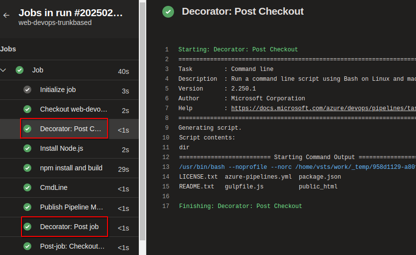

## Pipelines Decorator para Azure Pipelines

Esta es una prueba para pipelines decorators: [Author Pipeline Decorator](https://learn.microsoft.com/en-us/azure/devops/extend/develop/add-pipeline-decorator?view=azure-devops)

## Compilación

Usar el comando:

`npx tfx-cli extension create --rev-version`

## Publicación
[Package and publish extensions](https://learn.microsoft.com/en-us/azure/devops/extend/publish/overview?view=azure-devops)